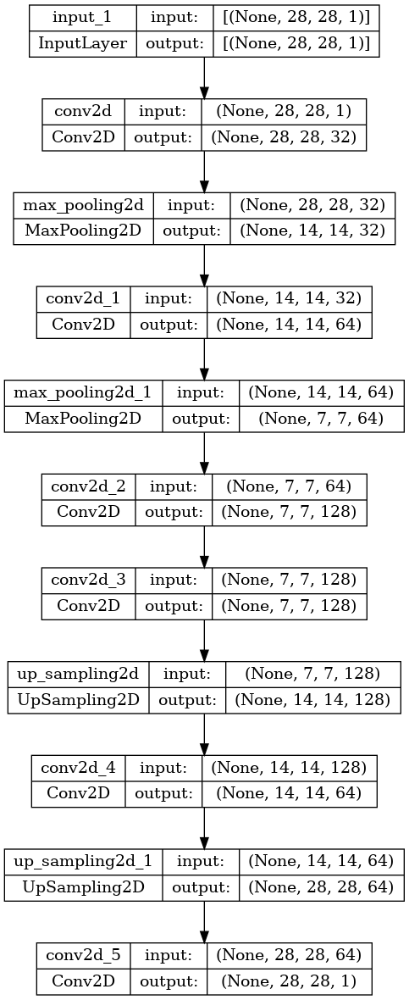
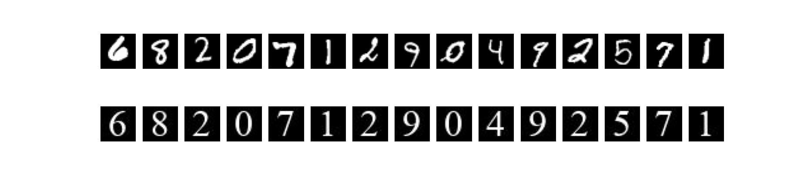
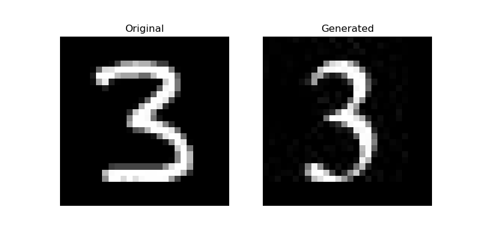

## Auto-Encoder Transformation Model: From Handwritten to Font Digits
Welcome to my project on Autoencoder for generating font digits from MNIST handwritten digit images! This project utilizes an autoencoder model to transform input MNIST handwritten digit images into corresponding font digits. The goal is to explore the capabilities of autoencoders in generating realistic font digits from the MNIST dataset. By leveraging the power of deep learning and image processing techniques, this project aims to showcase the potential applications of autoencoders in the field of image generation and transformation.

## Project Structure
```bash
├── images
├── test_image
├── logs
│   ├── train
│   └── validation
├── modelh5
│   └── auto-encoder-model.h5
├── synthetic_digits
│   ├── 0.jpg
│   ├── .....
│   └── 9.jpg
├── README.md
├── config.py
├── environment.yml
├── data_processor.py
├── encoder_model.py
├── inference.py
├── synthetic_image_generator.py
├── Times_New_Roman.ttf
├── visualize_model.py
└── train.py
```

#### **************** Process-Flow ****************
1. Environment Configuration.
2. Data Acquisition and Preprocessing.
3. Synthetic Target Data Generation.
4. Data Partitioning.
5. Model Architecture Design.
6. Model Training and Performance Monitoring.
7. Model Inference and Evaluation.

## 1. Environment Configuration
- Create virtual environment and install dependiencies with the below command
```console
conda env create -f environment.yml
```

- Then activate the environment

```bash
conda activate mnist_digit
```

#### !!! REMAINDER     !!! REMAINDER     !!! REMAINDER
If you want to inference the model, then directly scroll-down to Step **(7. Model Inference and Evaluation)** from here.


## 2. Data Acquisition and Preprocessing
- The MNIST dataset has been downloaded and processed(normalization and others task) has been performed. It is done in the ```data_processor.py``` file.


## 3. Synthetic Target Data Generation
Synthetic target data is generated using Python Imaging Library (PIL) where ```Times New Roman``` font is used.
Just run the script,
```synthetic_image_generator.py```
This will generate all digits```[0,...,9]``` and save to the directory ```/synthetic_letters``` as ```digit.jpg``` format.


## 4. Data Partitioning
By default, the MNIST dataset has 60000 train images and 10000 test images with shape (28, 28, 1). As there is no official instruction in this dataset for validation, I split the train data , and 10% of the train data is being used for valudation and 90% data for train. This is done in the ```data_processor.py``` file.

## 5. Model Architecture Design
For performing the targeted task, I build an auto-encoder model. It takes the handwritten image as input, and using the synthetic images as ground truth, the model learns to construct a proper image. The designed model is the following one, which is generated by running```visualize_model.py```.


## 6. Model Training and Performance Monitoring

Run the ```train.py``` file using the command

```bash
python train.py
```
The training will be completed and log file is saved on the directory ```/logs```.
And traning metrics in tensorboard can be visualized by the following command.
```bash
tensorboard -logdir logs
```

## 8. Model Inference and Evaluation
Activate the environment
```bash
conda activate mnist_digit
```
The following file is for Single image prediction.
Run the following file,
```bash
inference.py
```
Feel free to use binary handwritten digit image and test the model's performence.
#### Some test image and corresponding generated image.







#### ********** Thank you!! Any contributions are warmly welcomed!! **********